### 《计算机图形学》报告

#### 基本信息

学号：202220013 姓名：徐简 161200063@smail.nju.edu.cn

#### 开发环境

Python 3.8.4 64bits MacOS vscode

- pyqt           5.9.2

- pillow        8.2.0 
- numpy      1.20.1 

#### 测试环境

测试环境为[VirtualBox](https://www.virtualbox.org/wiki/Downloads)虚拟机：

- [Ubuntu 18.04 x86_64](https://ubuntu.com)
- Python 3.7.4
- [numpy 1.18.1](https://pypi.org/project/numpy/)
- [pillow 7.0.0](https://pypi.org/project/Pillow/)
- [pyqt 5.9.2](https://pypi.org/project/PyQt5/)

开发环境截图

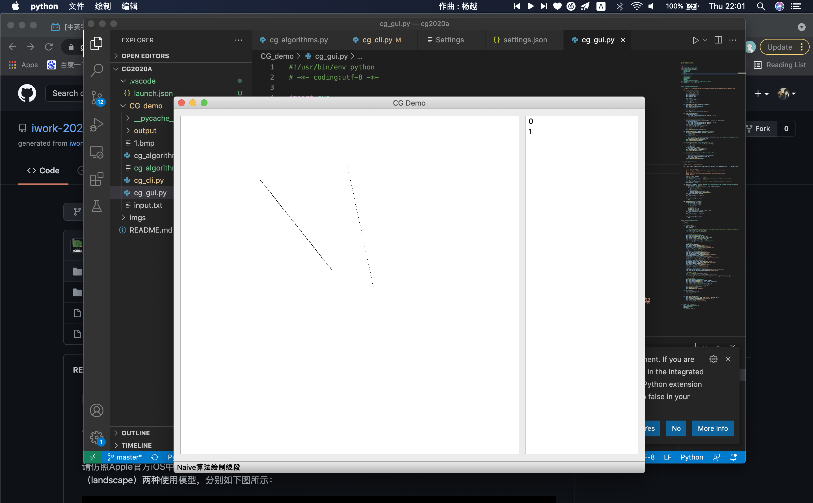


#### 进度

##### 九月

1. 阅读实验文档，了解实验的目标
2. 阅读框架代码，理解三个文件主要负责的功能

- `cg_algorithm.py`这个文件主要实现绘图代码的算法，每一个函数基本都代表相应的算法，函数接受一个list，其中包含绘图所必须的点。
- `cg_cli.py`负责解析命令行，并运行input.txt中的指令。一次性完成所有的测试项目，如果通过的话，会在output文件夹生成对应的图片文件。
- `cg_gui.py`本模块就是对于之前的一些功能的集成，并基于`pyQt`实现图形化的界面.

3.了解相关直线绘制算法

###### 计划

1. 先实现相对简单的直线生成算法
2. 对照input.txt 里的指令，逐步完成相应的算法

##### 十月

1. 完成DDA和bresenham直线生成算法

- DDA原理

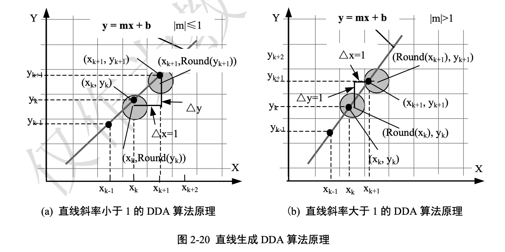

- Bresenham原理

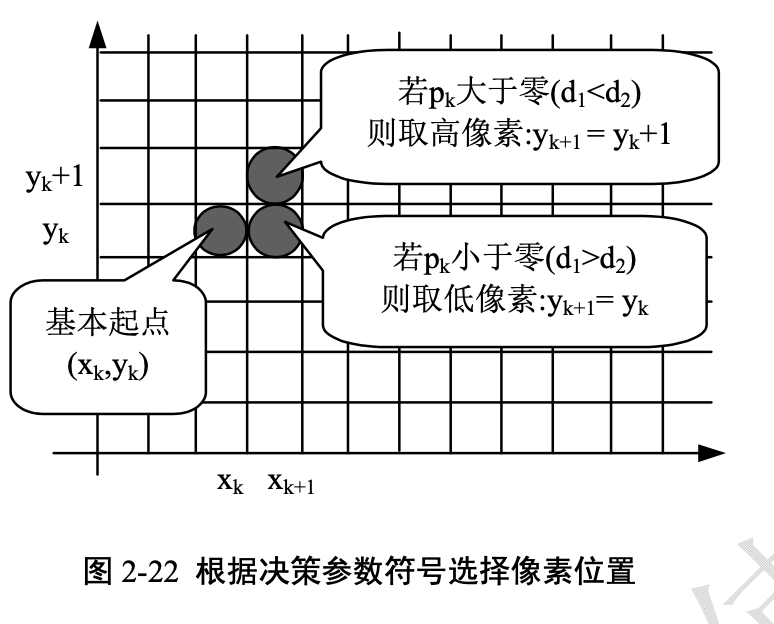

1. 完成多边形绘制算法
2. 学习pyQt，理解了图形化界面的原理
3. 将多边形算法，添加到图形界面

- 在Main Window中，注册并连接槽函数
- 完成多边形图元的绘制以及轮廓BoundingBox的设置
- 重载鼠标操作，完成多边形点的记录

###### 计划

1. 进一步实现相应的算法
2. 改写部分代码，使代码更加简洁


##### 十一月

1. 完成中点圆的椭圆算法

- 原理

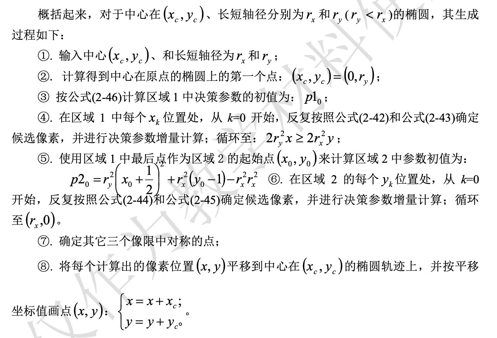

- 效果

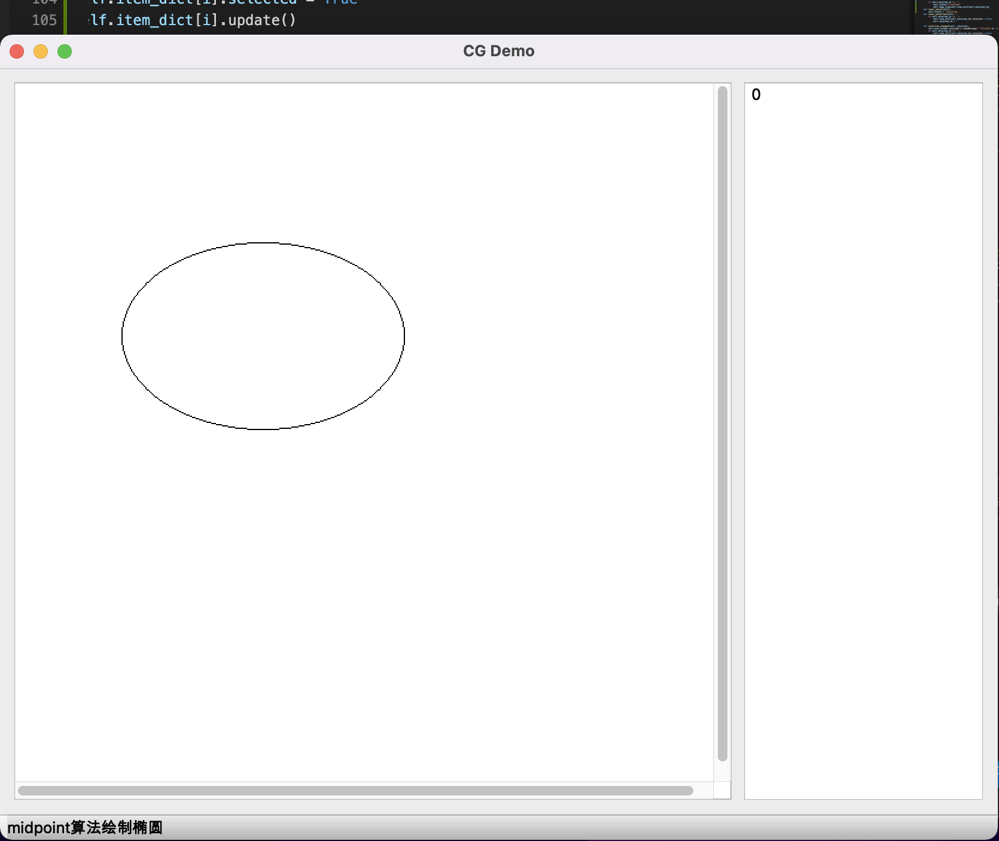

2. 完成平移算法

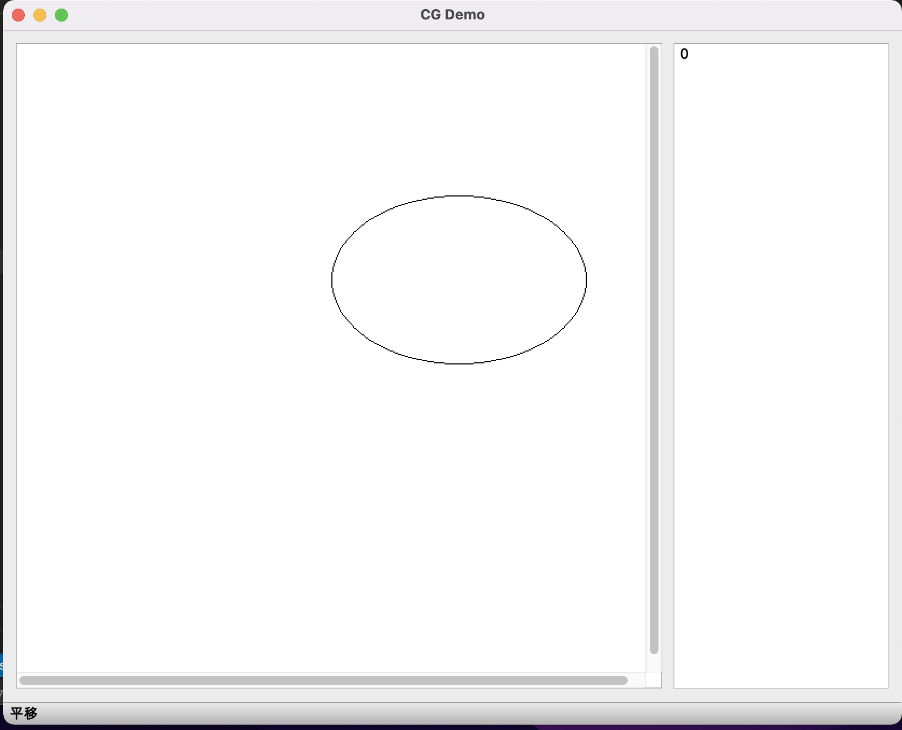

3. 将椭圆算法，添加至GUI程序中

4. 理解CLI程序的逻辑，并将以及完成的命令添加进去

```
resetCanvas 600 600
setColor 0 0 255
drawLine line1 0 0 200 200 DDA
drawEllipse ellipse1 0 0 400 200
translate line1 0 50
saveCanvas 1
```

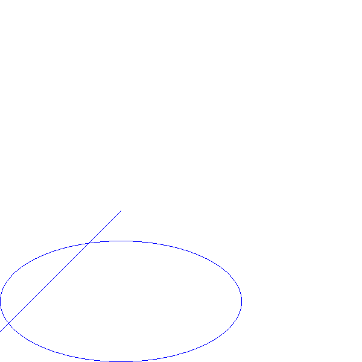

###### 计划

1. 十月十一月推进的有点慢了，十二月会抓紧完成剩下的算法
2. 进一步完善平移算法在GUI中的表现，目前只能在画布中仅有一个图元的时候生效，且平移只能往一个方向，如果换方向，需要松开鼠标再点击，不符合正常的逻辑
3. 增加扩展功能选择操作，这样使平移旋转等操作，更加符合日常操作的逻辑


##### 十二月

1.完成两种曲线算法

- 原理

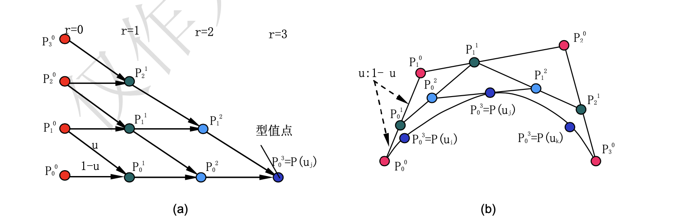

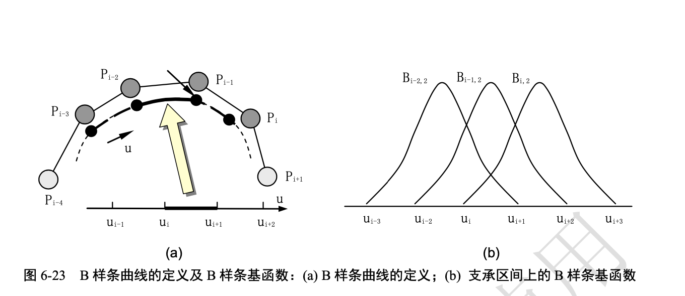

- 效果

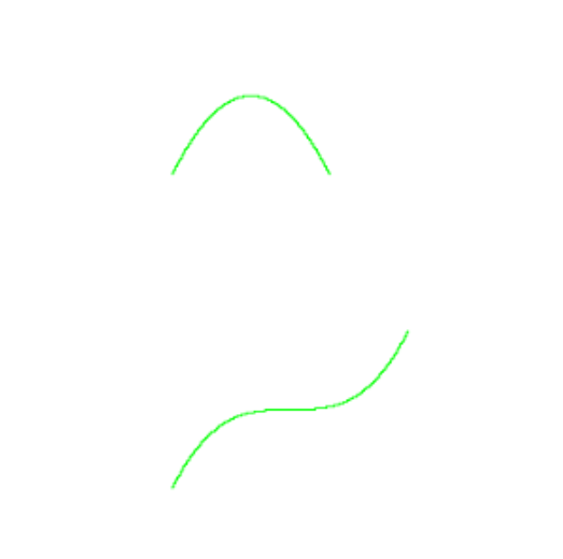


2. 完成平移算法

```python
def translate(p_list, dx, dy):
    """平移变换

    :param p_list: (list of list of int: [[x0, y0], [x1, y1], [x2, y2], ...]) 图元参数
    :param dx: (int) 水平方向平移量
    :param dy: (int) 垂直方向平移量
    :return: (list of list of int: [[x_0, y_0], [x_1, y_1], [x_2, y_2], ...]) 变换后的图元参数
    """
    temp_plist=[]
    for x,y in p_list:
        temp_plist.append((x+dx,y+dy))
    return temp_plist
```


3. 完成旋转算法

```python
def rotate(p_list, x, y, r):
    """旋转变换（除椭圆外）

    :param p_list: (list of list of int: [[x0, y0], [x1, y1], [x2, y2], ...]) 图元参数
    :param x: (int) 旋转中心x坐标
    :param y: (int) 旋转中心y坐标
    :param r: (int) 顺时针旋转角度（°）
    :return: (list of list of int: [[x_0, y_0], [x_1, y_1], [x_2, y_2], ...]) 变换后的图元参数
    """

    res=[]
    for item in p_list:
        x1=item[0]-x
        y1=item[1]-x
        x2 = x1 * math.cos(r / 180 * math.pi) - y1 * math.sin(r / 180 * math.pi)
        y2 = x1 * math.sin(r / 180 * math.pi) + y1 * math.cos(r / 180 * math.pi)
        res.append((int(x2+x),int(y2+y)))
    return res

```


4. 完成缩放算法

```python
def scale(p_list, x, y, s):
    """缩放变换

    :param p_list: (list of list of int: [[x0, y0], [x1, y1], [x2, y2], ...]) 图元参数
    :param x: (int) 缩放中心x坐标
    :param y: (int) 缩放中心y坐标
    :param s: (float) 缩放倍数
    :return: (list of list of int: [[x_0, y_0], [x_1, y_1], [x_2, y_2], ...]) 变换后的图元参数
    """
    res=[]
    for item in p_list:
        x1=(item[0]-x)*s
        y1=(item[1]-y)*s
        x2=x1+x
        y2=y1+y
        res.append((int(x2),int(y2)))
    return res
```


5. 完成两种线段分割算法

- 原理

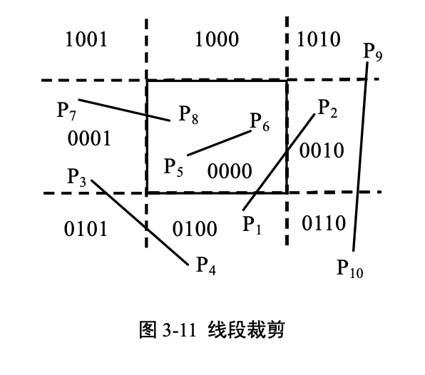


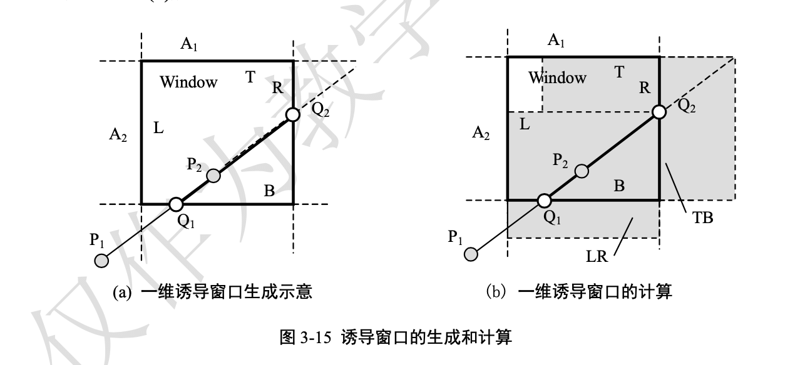

- 效果

在GUI中比较方便看出，因为也显示了裁剪窗口

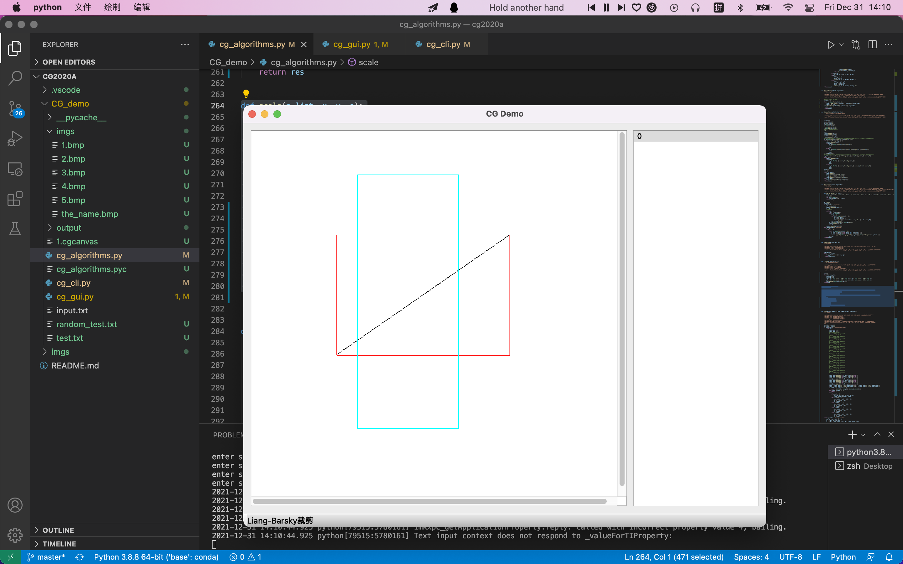


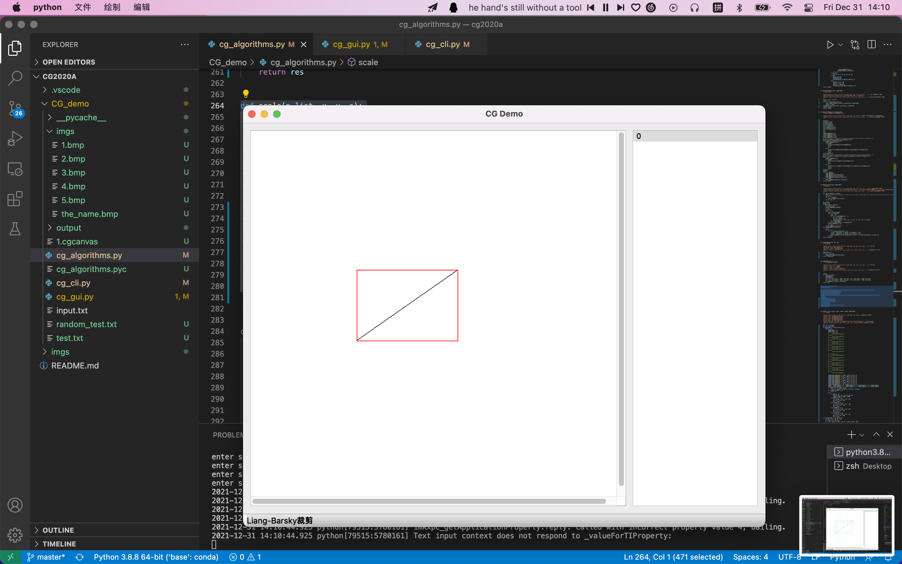


6. CLI部分

- 之前以及阅读并理解了CLI的逻辑，这里做的就是把新完成的算法，加入进去。

7. GUI部分（必做）

- 十二月的工作主要集中在GUI中，先实现了与命令行相同的部分，之后又添加了一些后续的功能
- PyQt的原理不再赘述，这里点击上方按钮之后，会改变全局的status，这个status决定了鼠标操作会调用了alg模块的算法
- mouse操作会将图元添加到系统中，图元自己的paint函数负责其显示在画面中。
- 具体实现写在下方

8. GUI拓展功能部分

- 实现了图元的删除
- 实现了画笔颜色的选择
- 实现了画布的重制
- 实现了画布的保存
- 实现了画布的加载
- 为常用的功能，添加了快捷键


### ALG实现原理

图形学算法的部分已经在进度部分介绍完毕，不再赘述

### CLI实现原理

- CLI程序读取每一行命令，并按空格分开，根据第一个词来区分不同的命令，并进入对应的分支。
- 值得一提的是，在接受到Draw这一系列命令的时候，并不会直接调用画图的函数，而是把相应的图元加入字典中，key为图元ID，value为实现该图元所需要的各种参数
- 当save Canvas命令被调用的时候，才会真正的显示图元，方法是遍历图元字典，根据图元的类型，调用相应的方法，得到p_list，最后将p_list中的点染上对应的颜色。

### GUI实现原理

1. GUI的实现原理和CLI的一脉相承的，都采取了图元管理与图元生成分开的方法。

2. 下面分几个类型，介绍一下GUI部分的实现原理。

3. 首先是最基础的画线、画多边形、画圆等等绘图算法

- 在菜单栏选中某一栏目的时候，程序的状态就被设定好了，以画圆为例，被设为“ellipse”
- 在画布中点击鼠标，会进入mouse_press的事件，这里记录鼠标点击的坐标，作为ellipse生成第一个点
- 在画布中移动鼠标，停住的点，作为ellipse生成的第二个点
- 注意到这里并不记录ellipse的绘制点，而是记录参数点，这样可以更好地实现管理，在鼠标移动的时候，不需要删除旧图形，因为图形是根据参数实时生成的，所以每次都会根据当前的参数，调用GraphicItem.paint，从而实现绘制
- 图元本身重要的组成有paint和bounding Box两个部分，第一个是用来显示图元，即根据参数调用算法，获得p_list。第二个是形状属性，简单地将就是外接矩形。这个属性在碰撞检测中比较重要，当然这里只用它来画选择框
- 以上就是基础绘制功能的GUI原理

4. 下面介绍平移、旋转、缩放、裁剪等算法

- 以核心在于从右边的选择图元
- 接下来的操作和上面一样，
- 鼠标的点击和移动提供算法所需要的参数，这里平移、缩放参数都是移动向量
- 裁剪参数是矩形的左上角和右下角

5. 选择画笔颜色

- 这里直接使用Qt自带的调色板即可

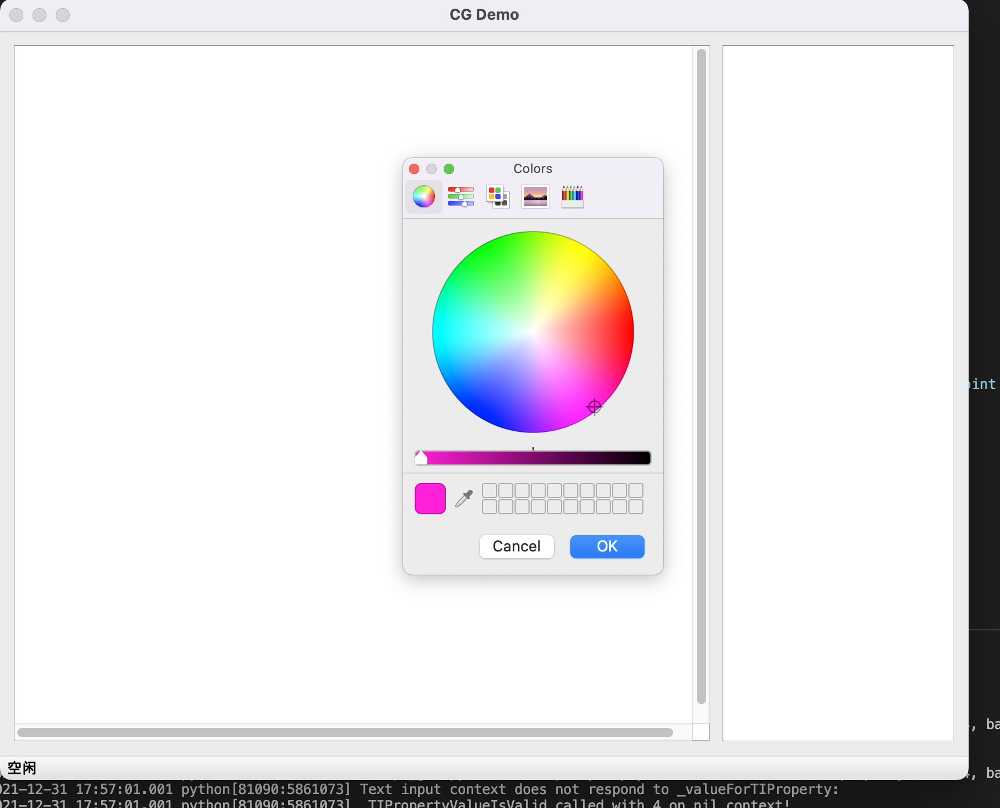

6. 重置画布

- 这里使用了Qt自带的对话框，从中获得画布的长和宽，并清空画布图元和相关参数

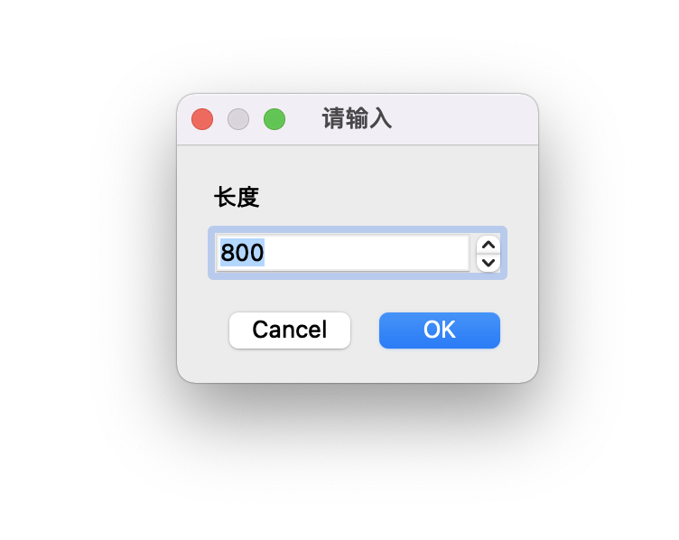

7. 保存、加载画布

- 这里使用了python中的pickle
- pickle序列化数据，提供了一个简单的持久化功能，可以将对象以文件的形式存放在磁盘上。

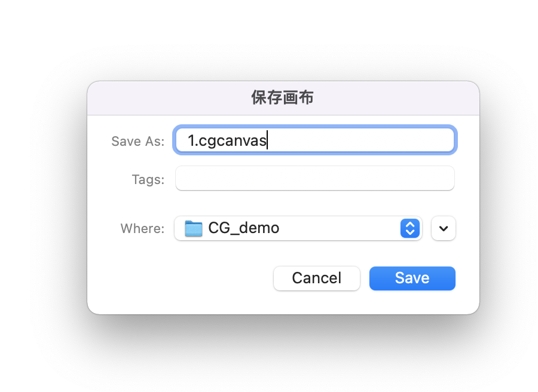


### 总结

通过计算机图形学的大作业，实现了课程上介绍的算法，从理论到实践，进一步理解了算法的原理和计算机图形学的核心。除了算法之外，还基于PyQt5实现了一个交互流畅图形学系统，也很好的锻炼了自己的编程能力。从系统中，也感受了很多面向对象、数据分离的编程思想，很有收获

### 参考文献

[1]《计算机图形学教程》孙正兴编 

[2] Python Pickle https://docs.python.org/3/library/pickle.html

[3] PyQT5 Tutorial https://www.riverbankcomputing.com/static/Docs/PyQt5/

[4] PPT


