# 图形学系统使用说明书

# 基本信息

姓名：徐简

学号：202220013 

联系方式：161200063@smail.nju.edu.cn

# 绘图算法

- 常见的功能设置了快捷键，在菜单栏里可以看到，基本和常用的软件类似
- 比如保存为ctrl+s等
- 文字和截图表达能力有限，可以结合视频，效果更好一点XD

## 直线绘制

如下图

1. 选中对应的菜单并打开，选择所需的绘图算法

2. 在画布中点击鼠标左键选中起始点，按住鼠标左键拖动，此时画布显示当前直线的样子
3. 拖动到所需的位置之后松开鼠标，对应的直线就会被添加到系统里，绘图结束

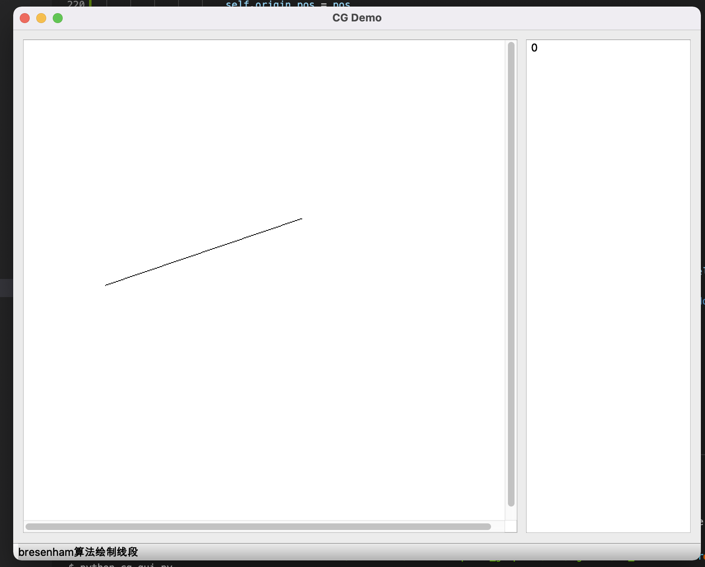

## 多边形绘制

1. 与直线绘制类似

## 椭圆绘制

1. 选中菜单里面的椭圆绘制
2. 在画布中点击鼠标的左键得到起始点
3. 按住鼠标左键拖动，调整椭圆的样子
4. 松开鼠标，结束绘制

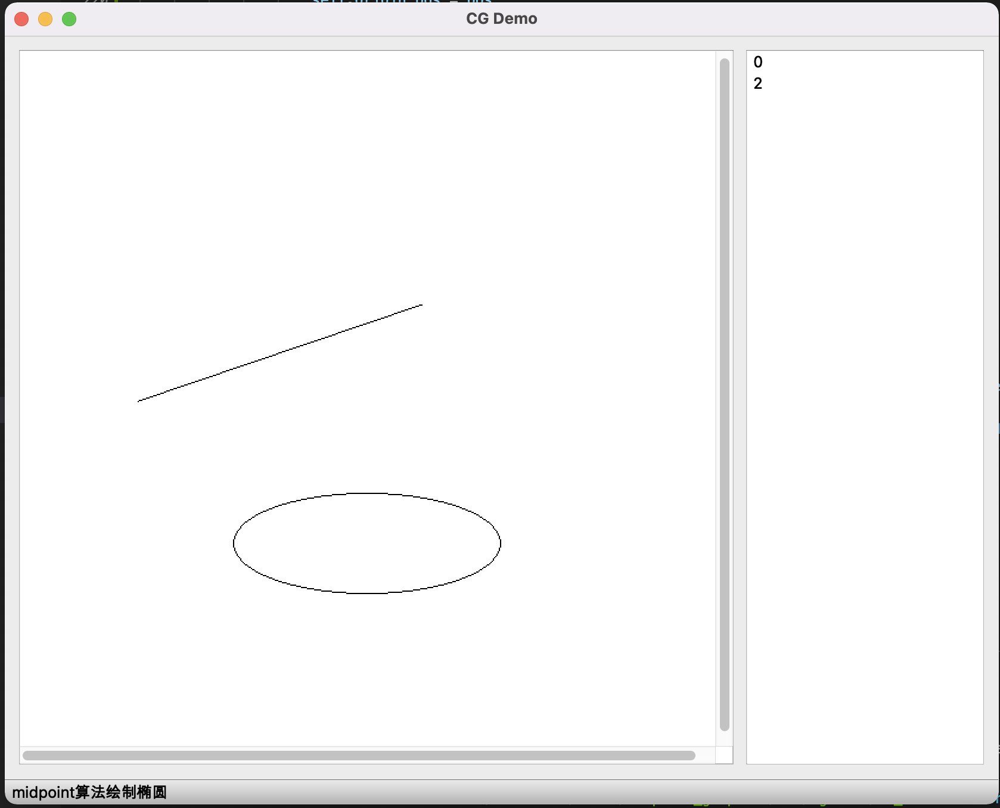

## 曲线绘制

曲线的绘制分为Bezier曲线和B样条曲线绘制

Bezier曲线的绘制的步骤和过程如下

1. 在菜单中正确的选择Bezier算法
2. 点击鼠标左键，选中了第一个起始点
3. 选择下一个控制点，有两种方法如下
   1. 拖动，松开鼠标左键代表确认
   2. 直接点击左键

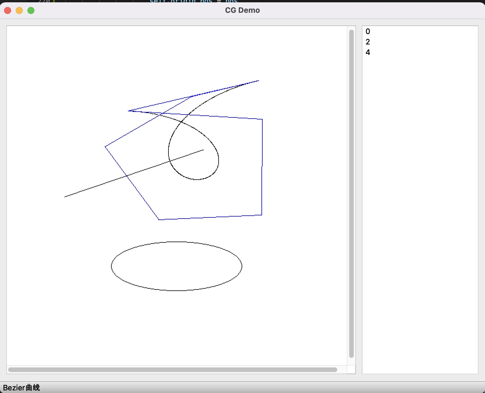

B样条曲线的绘制流程

1. 在菜单中选择和点击B样条算法

2. 点击左键选中了第一个点

3. 选择下一个控制点同样有两种方法
   1. 一种是点击鼠标左键拖动
   2. 直接左键点击
   
4. 反复选择和添加控制点

   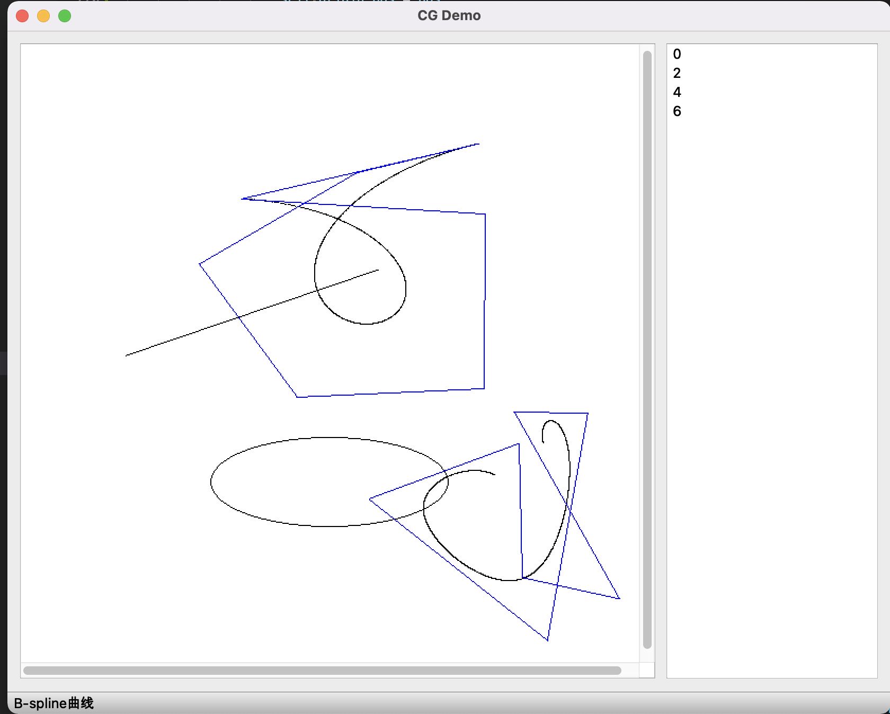

   

# 图元操作

## 平移

1. 点击右边列表，选中图元
2. 左键按住并拖动，图元进行平移
3. 松开左键，操作结束

下图为例子，步骤1，2即选中图元

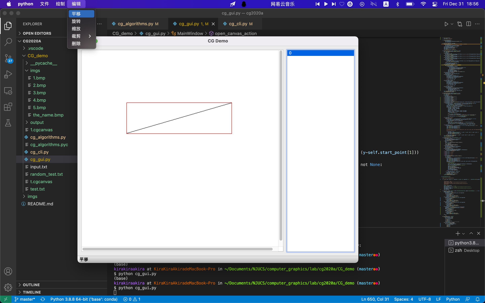

## 旋转

1. 选中图元
2. 鼠标左键点击，选择旋转中心
3. 左键按住并拖动，图元进行旋转

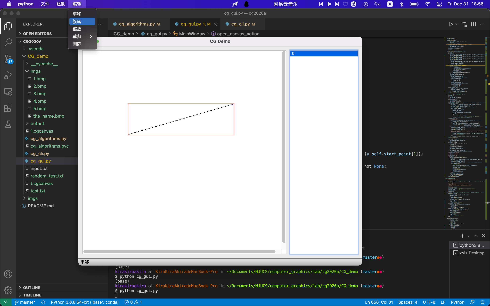

## 缩放

1. 准备和选中图元，同理，选择成功可以看到选中的边框
2. 在菜单中选中缩放功能（鼠标左键）
3. 在画布中点击，选中缩放中心
4. 紧接着选中缩放中心，按住鼠标的左键不放开，拖动鼠标的左键
5. 图元进行缩放

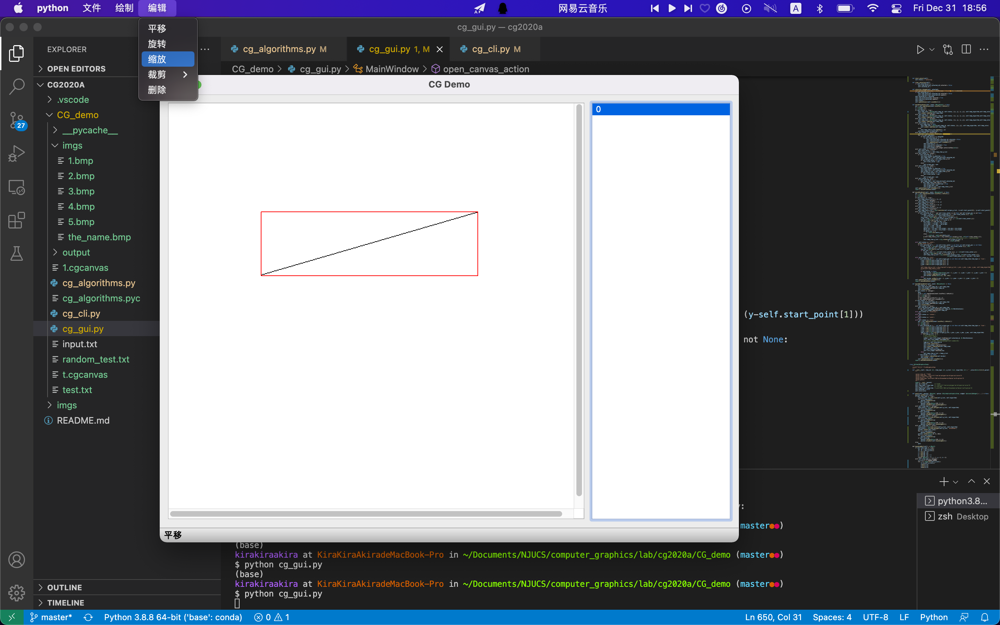

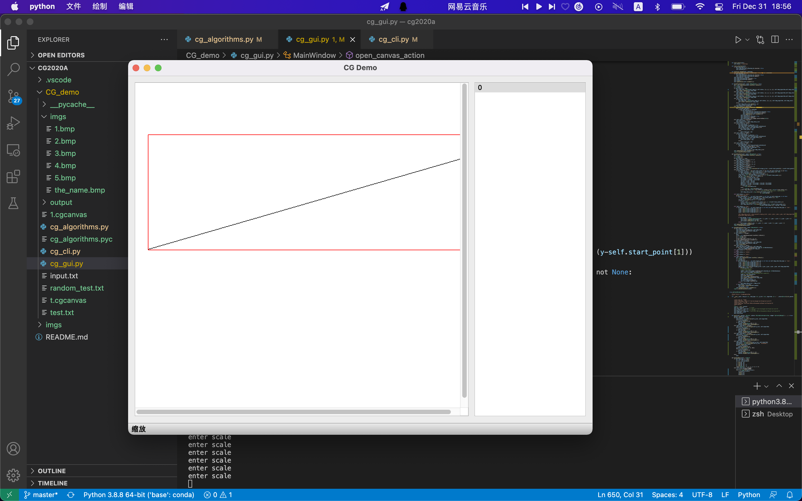

## 裁剪

1. 选中图元

2. 然后去菜单里选中对应的功能和想要使用的算法

3. 点击鼠标右键，选择一个裁剪窗口的起始点

4. 按住鼠标拖动，可以看到一个蓝色的框，这个就是对应的裁剪窗口

5. 松开鼠标左键，得到结果

   

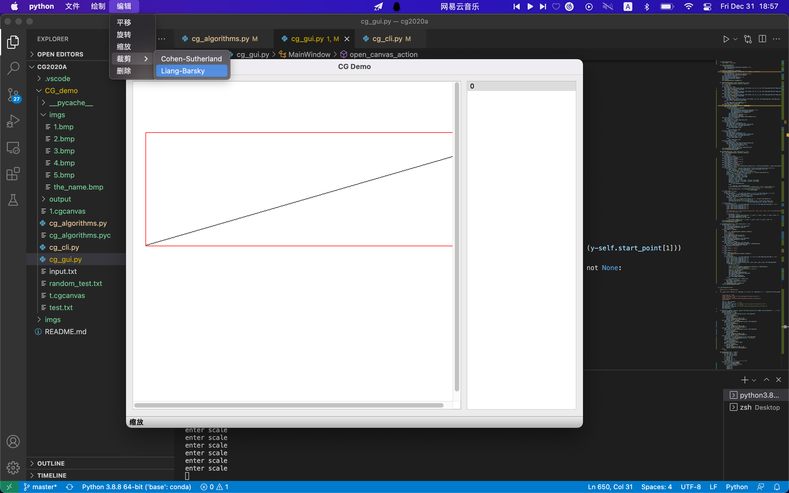

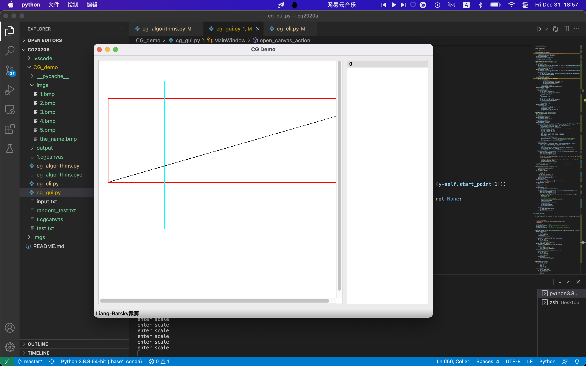

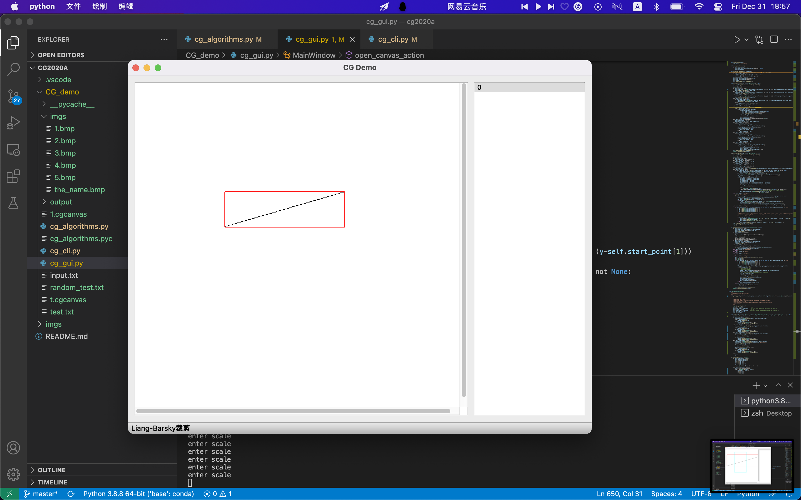

# GUI功能

## 重置画布

1. 点击菜单进入重置画布功能
2. 会出现对话框，要求输入画布的宽度和长度
3. 输入完成点击确认

## 保存、加载画布

1. 进入菜单，点击文件，可以看到选项里的保存画布
2. 然后鼠标左键选中保存画布功能
3. 即可看到保存文件的窗口
4. 在弹窗内输入需要的文件名
5. 点击保存即可

6. 进入菜单，点击文件，可以看到选项里的加载画布
7. 进入文件管理器，选择之前保存的画布
8. 点击确认，即可

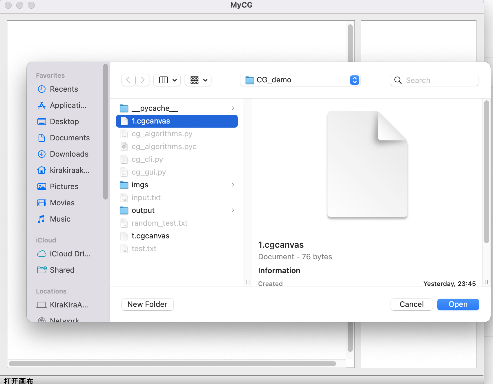

## 删除

删除功能的主要使用方式如下

1. 选中对象
3. 点击删除的按钮即可

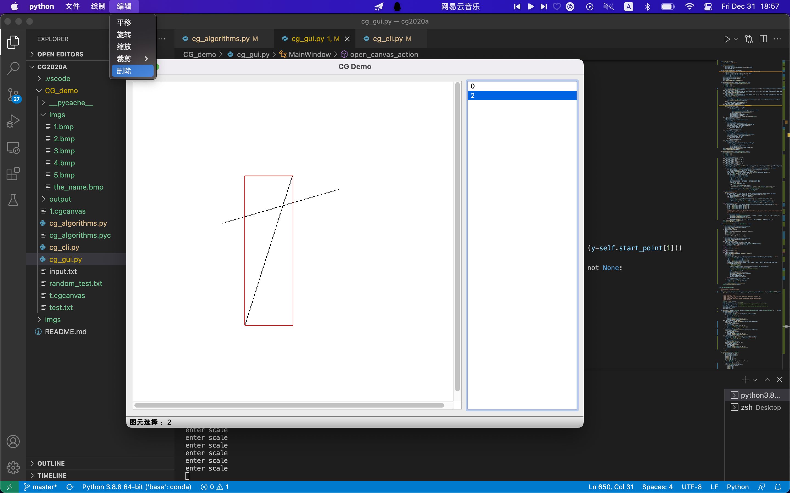

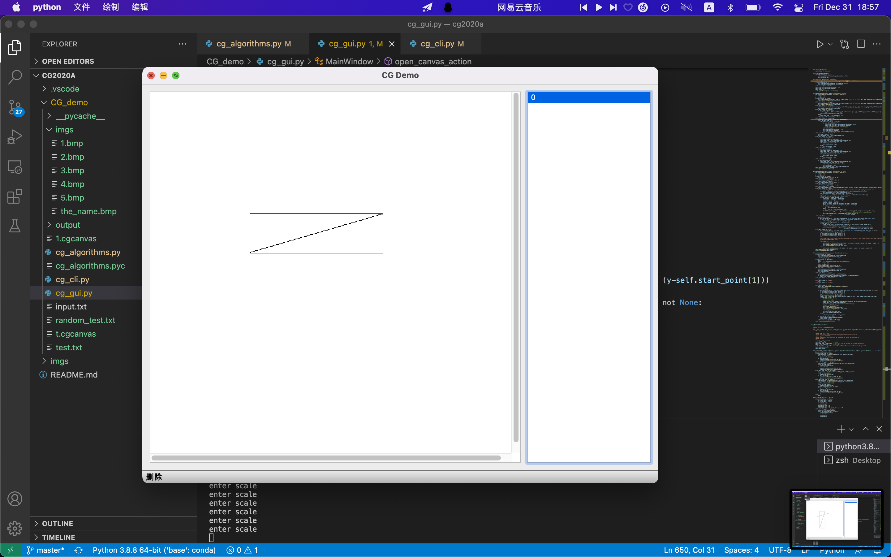

